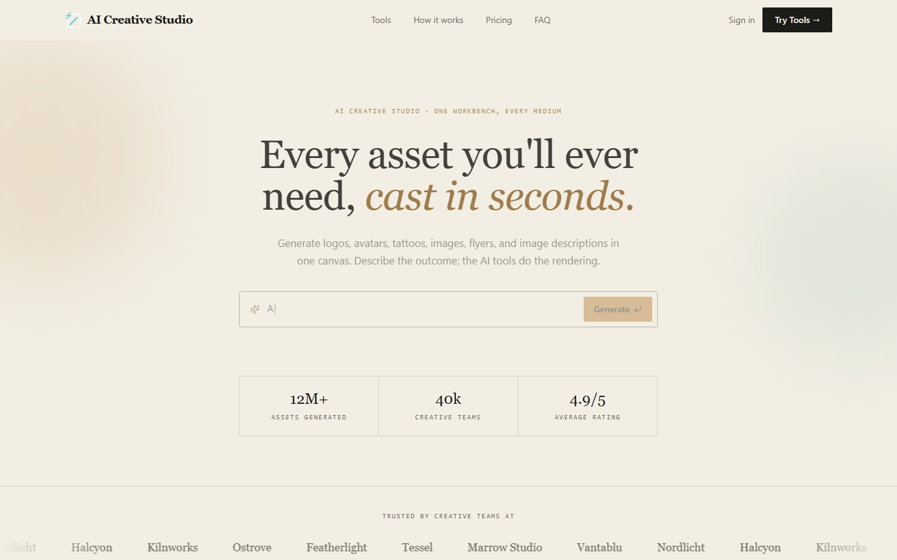
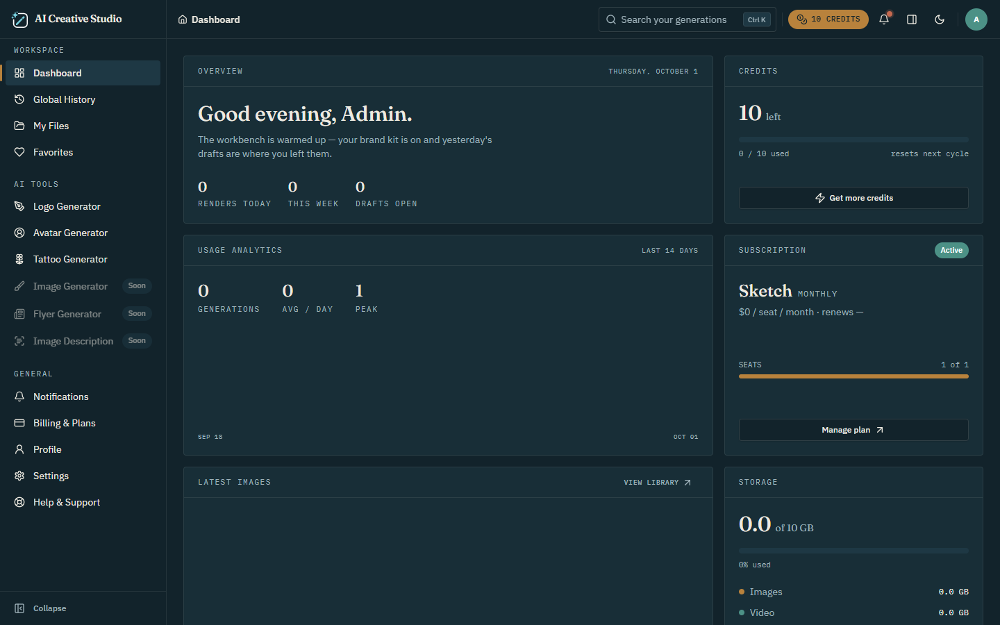
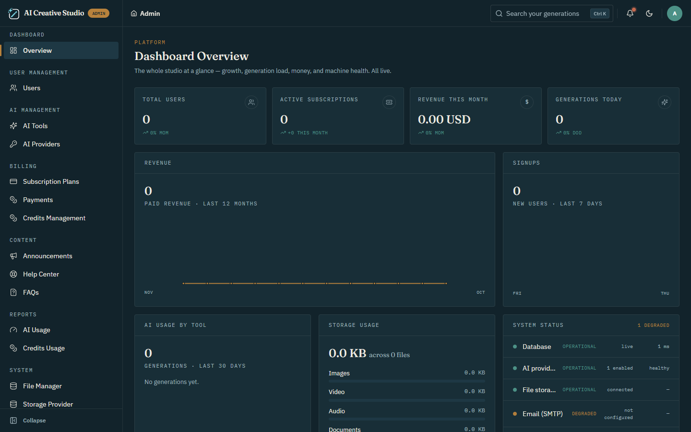
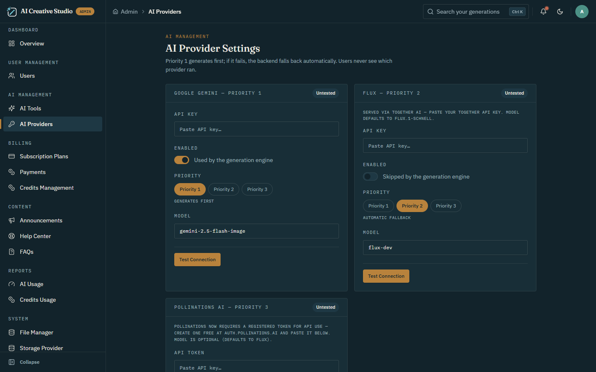

<div align="center">

# AI Creative Studio

**Six AI studios. One platform. Your SaaS.**

A complete, self-hosted AI design SaaS — Logo, Avatar, Tattoo, Image & Flyer
generation plus AI Image Description, with a credits economy, Stripe + PayPal
billing, invoices, and a full admin panel.

`React 19` · `TypeScript` · `Vite` · `Tailwind CSS` · `PHP 8.2` · `MySQL` · `Stripe` · `PayPal`

</div>

---

## Contents

1. [About the project](#about-the-project)
2. [Features](#features)
3. [Screenshots](#screenshots)
4. [Requirements](#requirements)
5. [System architecture](#system-architecture)
6. [Project structure](#project-structure)
7. [Setup from scratch](#setup-from-scratch)
8. [Configuration reference](#configuration-reference)
9. [Everyday commands](#everyday-commands)
10. [Production deployment](#production-deployment)
11. [Troubleshooting](#troubleshooting)
12. [Known limitations](#known-limitations)
13. [License](#license)

---

## About the project

AI Creative Studio is a two-part web application:

- **`backend/`** — a REST API written in plain PHP 8.2 (no framework). It owns
  authentication, the credit ledger, AI provider calls, file storage, billing,
  and every admin function. All data lives in MySQL.
- **`frontend/`** — a React 19 single-page app. It contains the public landing
  page, the sign-in / sign-up screens, the user workspace (`/app`), and the
  admin panel (`/admin`).

The two halves run as separate processes and talk only over HTTP/JSON, so they
can be hosted together or on different servers.

> **This is not a Laravel project.** There is no `artisan`. The equivalents are
> Composer scripts — see [Everyday commands](#everyday-commands).

## Features

| | |
|---|---|
| **6 AI tools** | Logo, Avatar, Tattoo, Image and Flyer generators, plus vision-to-text Image Description |
| **Three AI providers** | Google Gemini, FLUX (Together AI) and Pollinations — tried in priority order with automatic failover and live connection tests |
| **Credits economy** | Per-tool pricing, live balances, cycle allowances, daily limits, automatic refunds on failed runs |
| **Payments** | Stripe Checkout and PayPal Orders v2, signature-verified webhooks, printable invoices, CSV export |
| **Library** | Global history, My Files with storage quotas, per-image favorites, one-click re-runs |
| **Admin panel** | Users, AI tools, AI providers, plans, payments, credits, announcements, help center, FAQs, reports, file manager, storage, email, security, general settings |
| **Authentication** | JWT access tokens + rotating refresh tokens, email verification, password reset, device-session revoke |
| **UI** | Dark app workspace, light animated landing page, light/dark theme switch, responsive |

## Screenshots

Captured from a fresh install; more are in [screenshots/](screenshots/).

| Landing page | User dashboard |
|---|---|
|  |  |

| Admin overview | Admin · AI providers |
|---|---|
|  |  |

---

## Requirements

### Software

| Software | Version | Needed for |
|---|---|---|
| PHP | **8.2 or newer** | Backend API |
| PHP extensions | `pdo_mysql`, `json`, `curl`, `openssl` | Database, AI/payment HTTP calls, encryption |
| Composer | 2.x | Installing backend dependencies and running the CLI scripts |
| MySQL | **5.7+** (or MariaDB 10.4+) | All application data |
| Node.js | **18+** (20 or 22 recommended) | Frontend development and builds |
| npm | bundled with Node | Frontend dependencies |
| Apache with `mod_rewrite` | optional | Only if you host the API under Apache instead of PHP's built-in server |

XAMPP, Laragon and Laravel Herd all ship a suitable PHP and MySQL.

### External accounts

Only one AI provider is required to generate images. Everything else is optional.

| Service | Required? | Used for |
|---|---|---|
| Pollinations token (free, `auth.pollinations.ai`) | one provider required | Image generation |
| Google AI Studio API key (Gemini) | optional; **required for Image Description** | Image generation, vision-to-text |
| Together AI API key (FLUX) | optional | Image generation |
| Stripe and/or PayPal | optional | Selling paid plans |
| SMTP server | optional | Verification, password-reset and receipt emails (skipped when not configured) |

### Hardware / hosting

Runs on shared hosting, a VPS, or a dedicated server. Generated images are
written to local disk under `backend/public/storage/`, so that folder must be
writable and sized for your expected usage.

---

## System architecture

### High-level view

```
┌──────────────────────────────┐         ┌───────────────────────────────────────┐
│  Browser                     │         │  Backend API  (PHP 8.2, no framework) │
│  React 19 SPA (Vite build)   │  HTTPS  │  http://localhost:8001/api/v1         │
│  http://localhost:3001       │◄───────►│                                       │
│                              │  JSON   │  public/index.php  (front controller) │
│  /        landing            │  + JWT  │        │                              │
│  /auth    sign-in / sign-up  │  Bearer │  Router → Middleware → Controller     │
│  /app     user workspace     │         │                  │                    │
│  /admin   admin panel        │         │              Service                  │
└──────────────────────────────┘         │                  │                    │
                                         │             Repository (PDO)          │
                                         └───────┬──────────┬───────────┬────────┘
                                                 │          │           │
                                        ┌────────▼───┐ ┌────▼─────┐ ┌───▼──────────────┐
                                        │  MySQL     │ │ Local    │ │ External APIs    │
                                        │  database  │ │ disk     │ │ Gemini · FLUX ·  │
                                        │            │ │ storage  │ │ Pollinations ·   │
                                        └────────────┘ └──────────┘ │ Stripe · PayPal ·│
                                                                    │ SMTP             │
                                                                    └──────────────────┘
```

### Backend layers

The backend is a small layered application with PSR-4 autoloading (`App\` → `backend/src/`).

| Layer | Location | Responsibility |
|---|---|---|
| Front controller | `public/index.php` | Loads `.env`, sets CORS headers, dispatches the request |
| Routing | `routes/api.php`, `src/Core/Router.php` | About 160 routes, all versioned under `/api/v1` |
| Middleware | `src/Middleware/` | `AuthMiddleware` validates the JWT and enforces maintenance mode; `AdminMiddleware` additionally requires `role = admin` |
| Controllers | `src/Controllers/` (+ `Admin/`) | Thin HTTP layer: read the request, call a service, return the response envelope |
| Services | `src/Services/` | Business logic — auth, generation engine, billing, notifications, mail, storage |
| Repositories | `src/Repositories/` | All SQL, PDO prepared statements only |
| Core | `src/Core/` | `Database`, `Request`, `Response`, `Validator`, `Logger` |

Every endpoint returns the same JSON envelope:

```json
{
  "success": true,
  "message": "Signed in.",
  "data": {},
  "errors": null,
  "meta": { "timestamp": "…", "request_id": "…" }
}
```

Validation failures return HTTP 422 with `errors: { field: ["message"] }`.

### Frontend structure

The SPA is organised by feature (`frontend/src/features/`): `landing`, `auth`,
`dashboard`, one folder per AI tool, `history`, `files`, `favorites`,
`billing`, `notifications`, `profile`, `settings`, `support`, and `admin`.

- **Routing** — React Router 7 (`src/app/router.tsx`), with lazy-loaded pages
  and three shells: marketing, `/app` workspace, `/admin` panel.
- **State** — Zustand stores; the auth session and UI preferences persist in
  `localStorage`.
- **API access** — `src/lib/api-client.ts` attaches the bearer token, unwraps
  the envelope, and retries once after refreshing an expired access token.
- **Forms** — React Hook Form with Zod validation.
- **Styling** — Tailwind CSS 4.

### Authentication flow

1. `POST /auth/register` or `/auth/login` returns a short-lived **access token**
   (HS256 JWT, 15 minutes) and an opaque **refresh token** (30 days).
2. The frontend stores both in `localStorage` and sends
   `Authorization: Bearer <access token>` on every request.
3. When the API answers 401, the client calls `/auth/refresh-token`, which
   rotates the refresh token and issues a new pair, then retries the request.
4. Refresh tokens are stored only as SHA-256 hashes; passwords use Argon2id.
   Logout and password reset revoke the matching sessions.

### AI generation flow

```
Studio page ──► POST /api/v1/ai/{tool}/generate   (tool + prompt + options only)
                    │
                    ▼
            AiGenerationService
              1. load tool config from ai_tools (live? cost? prompt limit? timeout?)
              2. enforce email-verification, daily credit limit, storage caps
              3. spend credits through the row-locked ledger
              4. build the final prompt on the server
                    │
                    ▼
            AIProviderManager ── tries enabled providers in priority order ──►
              Gemini → FLUX → Pollinations   (stops at the first success)
                    │
        ┌───────────┴────────────┐
     success                  all failed
        │                        │
  save image to disk       refund credits, return the
  write ai_generations,    providers' real error messages
  files, generation_history
```

The frontend never chooses a provider and never sees provider keys. Adding a
provider means one class implementing `AIProviderInterface` plus one row in
`ai_providers`.

### Billing flow

1. `POST /billing/checkout` creates a **pending** payment and returns the
   gateway's hosted-checkout URL (Stripe or PayPal).
2. The user pays on the gateway and is redirected back.
3. `POST /billing/checkout/confirm` **verifies the payment with the gateway
   API** — the browser is never trusted.
4. Only after verification does the backend activate the subscription, grant
   the cycle's credits, write the invoice, and send the receipt.
5. Webhooks (`/api/v1/webhooks/stripe`, `/api/v1/webhooks/paypal`) are
   signature-verified and de-duplicated, so a webhook racing the redirect
   cannot grant credits twice.

### Data model

`composer migrate` applies 32 ordered SQL migrations. The main table groups:

| Area | Tables (main ones) |
|---|---|
| Auth | `users`, `user_profiles`, `user_sessions`, `refresh_tokens`, `password_resets`, `email_verifications` |
| AI | `ai_tools`, `ai_providers`, `ai_generations`, `generation_history`, `favorites` |
| Storage | `files`, `folders`, storage providers |
| Billing | `plans`, `subscriptions`, `payments`, `credit_transactions` (the ledger), coupons, webhook logs |
| Content | `announcements`, `help_articles`, `faqs`, `notifications`, `support_tickets` |
| System | `platform_settings`, `user_settings`, `activity_logs`, security events, `migrations` |

Credits have a single source of truth: every figure shown anywhere is computed
from the `credit_transactions` ledger. See
[backend/database/SCHEMA.md](backend/database/SCHEMA.md) for the full ERD and
[backend/README.md](backend/README.md) for the complete endpoint reference.

---

## Project structure

```
creative-studio/
├── backend/                    PHP 8.2 REST API
│   ├── public/                 web root: index.php, .htaccess, storage/ (generated images, avatars)
│   ├── routes/api.php          every route
│   ├── src/
│   │   ├── Config/             typed .env access
│   │   ├── Core/               Router, Request, Response, Database, Validator, Logger
│   │   ├── Middleware/         AuthMiddleware, AdminMiddleware
│   │   ├── Controllers/        HTTP layer (Admin/ holds the admin endpoints)
│   │   ├── Services/           business logic (AI providers, payments, storage, mail…)
│   │   ├── Repositories/       all SQL
│   │   └── Exceptions/
│   ├── database/
│   │   ├── migrations/         001 … 032 .sql files
│   │   ├── migrate.php         migration runner
│   │   ├── make-admin.php      promote a user to admin
│   │   └── credits-cycle.php   monthly credit reset / expiry job
│   ├── storage/logs/           daily log files
│   ├── .env.example
│   └── composer.json
├── frontend/                   React 19 + TypeScript + Vite
│   ├── src/
│   │   ├── app/                router, providers, layouts
│   │   ├── features/           one folder per feature (see above)
│   │   ├── components/         shared UI
│   │   ├── lib/                api-client, env validation, helpers
│   │   └── stores/             Zustand stores
│   ├── dist/                   prebuilt production bundle
│   ├── .env.example
│   └── vite.config.ts
├── screenshots/                frontend/ and admin/ page captures
├── SETUP_GUIDE.md              longer walkthrough (written for the upstream default ports)
├── CHANGELOG.md
└── README.md
```

---

## Setup from scratch

These steps use the ports this project is configured for: **backend on 8001,
frontend on 3001**.

### 1. Install the prerequisites

Install PHP 8.2+, Composer, MySQL and Node.js (see [Requirements](#requirements)),
then confirm them:

```bash
php -v
php -m            # must list pdo_mysql, curl, openssl
composer -V
node -v
```

### 2. Create the database

Start MySQL, then create an empty database (phpMyAdmin works too):

```sql
CREATE DATABASE creative_studio CHARACTER SET utf8mb4 COLLATE utf8mb4_unicode_ci;
```

Do not import anything — the migrations create every table.

### 3. Configure the backend

```bash
cd backend
cp .env.example .env            # Windows: copy .env.example .env
composer install
php -r "echo bin2hex(random_bytes(32));"     # generates a JWT secret
```

Edit `backend/.env`:

```ini
APP_URL=http://localhost:8001
CORS_ALLOWED_ORIGIN=http://localhost:3001

DB_HOST=127.0.0.1
DB_PORT=3306
DB_DATABASE=creative_studio
DB_USERNAME=root
DB_PASSWORD=

JWT_SECRET=<paste the generated secret>
```

`CORS_ALLOWED_ORIGIN` must match the frontend URL **exactly** (scheme, host and
port), or the browser will block every API call.

### 4. Run the migrations

```bash
composer migrate
```

You should see 32 migrations applied. The command is safe to re-run; it prints
"Nothing to migrate" when the database is up to date.

### 5. Start the backend

```bash
composer serve                  # http://localhost:8001
```

Check it: <http://localhost:8001/api/v1/plans> should return JSON with
`"success": true`. (Opening `/` returns "Endpoint not found" — that is normal.)

### 6. Configure and start the frontend

In a second terminal:

```bash
cd frontend
cp .env.example .env            # Windows: copy .env.example .env
npm ci
```

Edit `frontend/.env`:

```ini
VITE_APP_NAME="AI Creative Studio"
VITE_API_URL="http://localhost:8001/api"
```

Then start it:

```bash
npm run dev                     # http://localhost:3001
```

The dev server is pinned to port 3001 (`strictPort`). If the port is busy it
stops with an error instead of silently moving to another port, because any
other port would be rejected by CORS.

### 7. Create the admin account

There are no default credentials. The order matters:

1. Open <http://localhost:3001> and use the **Sign up** form (or call the API
   directly):

   ```bash
   curl -X POST http://localhost:8001/api/v1/auth/register \
     -H "Content-Type: application/json" \
     -d '{"name":"Admin","email":"admin@test.com","password":"Admin@12345"}'
   ```

2. Promote that account, from `backend/`:

   ```bash
   composer make-admin admin@test.com
   ```

3. **Log out and log in again** — the admin role is read at login. The admin
   panel is at <http://localhost:3001/admin>.

### 8. Enable an AI provider

In **Admin → AI Providers**:

- **Pollinations** — paste a free token from `auth.pollinations.ai`, save, press **Test**.
- **Gemini** — paste a Google AI Studio key, press **Test**.
- **FLUX** — paste a Together AI key, press **Test**.

Set the priority order (1 is tried first). Then open **Admin → AI Tools** and
switch the tools you want to **Live**.

### 9. Verify the install

1. Open the **Logo Generator**, describe a logo, press **Generate**.
2. The result appears on the canvas and in **Global History** and **My Files**.
3. Download it.

If all three work, setup is complete.

---

## Configuration reference

### `backend/.env`

| Key | Purpose |
|---|---|
| `APP_NAME`, `APP_ENV`, `APP_DEBUG` | App name; `local` or `production`; detailed errors (turn off in production) |
| `APP_URL` | Public URL of the API — used for file URLs and email links |
| `CORS_ALLOWED_ORIGIN` | The one frontend origin allowed to call the API |
| `DB_HOST`, `DB_PORT`, `DB_DATABASE`, `DB_USERNAME`, `DB_PASSWORD`, `DB_CHARSET` | MySQL connection |
| `JWT_SECRET`, `JWT_ISSUER`, `JWT_ACCESS_TTL`, `JWT_REFRESH_TTL` | Token signing and lifetimes (seconds). The secret also derives the key that encrypts stored gateway/storage credentials — do not change it after go-live |
| `MAIL_HOST`, `MAIL_PORT`, `MAIL_USERNAME`, `MAIL_PASSWORD`, `MAIL_ENCRYPTION`, `MAIL_FROM_ADDRESS`, `MAIL_FROM_NAME` | SMTP transport |
| `LOG_LEVEL` | `debug`, `info`, `warning` or `error` |
| `GOOGLE_AI_API_KEY`, `GOOGLE_AI_IMAGE_MODEL`, `GOOGLE_AI_TIMEOUT` | Gemini fallback key, used when no key is saved in the admin panel |

### `frontend/.env`

| Key | Purpose |
|---|---|
| `VITE_APP_NAME` | Display name |
| `VITE_API_URL` | Base URL of the API, ending in `/api`. **Baked in at build time** — rebuild after changing it |

### In-app settings (admin panel)

| What | Where |
|---|---|
| AI provider keys, priority, models | Admin → AI Providers |
| Tool availability, credit cost, prompt limit | Admin → AI Tools |
| Plans and pricing (yearly price = total per year) | Admin → Subscription Plans |
| Payment gateways, currency, invoice prefix | Admin → Payment Settings |
| Welcome credits, daily limit, expiry | Admin → Credits Management |
| SMTP and email templates | Admin → Email |
| Site name, maintenance mode | Admin → General |

---

## Everyday commands

| Where | Command | Purpose |
|---|---|---|
| `backend/` | `composer serve` | Run the API on `localhost:8001` |
| `backend/` | `composer migrate` | Apply pending migrations |
| `backend/` | `composer make-admin <email>` | Promote a user to admin |
| `backend/` | `composer credits-cycle` | Monthly credit reset and expiry (run from cron) |
| `frontend/` | `npm run dev` | Dev server on `localhost:3001` |
| `frontend/` | `npm run build` | Production build into `dist/` |
| `frontend/` | `npm run typecheck` | TypeScript check |
| `frontend/` | `npm run lint` | ESLint |

## Production deployment

1. **Backend** — point the web server's document root at `backend/public`
   (the only folder that should be web-exposed). The included `.htaccess`
   handles the Apache rewrite and forwards the `Authorization` header. Set
   `APP_ENV=production`, `APP_DEBUG=false`, a real `APP_URL`, and the real
   frontend origin in `CORS_ALLOWED_ORIGIN`. Run `composer install --no-dev`
   and `composer migrate`.
2. **Frontend** — set `VITE_API_URL` to the production API URL, run
   `npm run build`, and host `frontend/dist/` on any static server. Configure
   it to serve `index.html` for unknown paths (SPA fallback).
3. **Cron** — schedule the credit cycle daily:
   `0 1 * * * cd /path/to/backend && composer credits-cycle`
4. **Webhooks** — register `https://YOUR-API/api/v1/webhooks/stripe` and
   `/webhooks/paypal` in the gateway dashboards and store the signing secret /
   webhook ID in Admin → Payment Settings.
5. Serve both over HTTPS and make sure `backend/public/storage/` and
   `backend/storage/logs/` are writable.

## Troubleshooting

| Problem | Fix |
|---|---|
| `Could not open input file: artisan` | This is not Laravel. Use `composer migrate`, `composer serve`, etc. |
| CORS error in the browser console | The page's origin does not match `CORS_ALLOWED_ORIGIN`. Open the app on exactly `http://localhost:3001`, or update the value and restart the backend |
| `localhost:8001` shows "Endpoint not found." | Healthy — there is no route at `/`. Try `/api/v1/plans` |
| "Could not reach the server" | The backend is not running, or `VITE_API_URL` points to the wrong port |
| `npm run dev` fails with "Port 3001 is already in use" | Another dev server is already running on 3001 — use that one or stop it |
| "Invalid email or password" | The account does not exist yet — sign up first |
| `composer make-admin` says "No account found" | Sign-up did not complete, or you used a different email |
| Admin menu missing after promotion | Log out and log in again |
| Pages error after login | Migrations were not run — `composer migrate` |
| Generation fails with a provider message | That is the provider's real answer (key, quota, balance). Fix the key in Admin → AI Providers or enable another provider |
| Emails do not arrive | Fill the `MAIL_*` values or configure SMTP in Admin → Email, then send a test |

## Known limitations

- English-only interface.
- Prompt-based generation only (no image-to-image).
- Hosted checkout charges once per cycle; there is no card-on-file auto-renewal.
- No tax engine.
- Email + password login only.

## License

**MIT** — free to use, modify, and self-host. See [LICENSE](LICENSE).

Built by **Aasim Ghaffar** ([CubixSol](https://cubixsol.com)).
